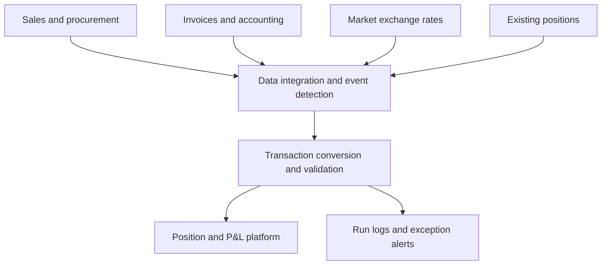

**English** | [繁體中文](README_ZH-TW.md)

# FX Risk Position Automation

Built a standardized and auditable FX risk workflow that reflects sales, procurement, and accounting events in position records, improving the accuracy of exposure recognition, settlement, and reconciliation. The system integrates contracts, purchase orders, invoices, market rates, and existing positions to automate position creation, adjustment, and settlement, processing approximately **USD 100 million in FX-related transaction value per month**.

## Project Overview

| Item | Description |
|---|---|
| Business domain | Sales, procurement, finance, and FX risk management |
| My role | User and operational needs clarification, rule design, data integration, workflow development |
| Technology | Python, Pandas, SQL, relational databases, job scheduling |
| Monthly processing volume | Approximately USD 100 million in FX-related transaction value processed through automated posting |

## Business Challenge

FX exposure begins when a foreign-currency sales contract or purchase order is confirmed and continues until the corresponding receivable or payable is recognized. Changes in amount, cancellation, and invoicing alter the open position. Because the required data was distributed across systems, manual reconciliation created a risk of missing, duplicate, or incomplete position entries.

## Approach

1. Integrated contracts, purchase orders, invoices, exchange rates, and existing position data.
2. Standardized dates, currencies, document numbers, line items, and amounts.
3. Compared source transactions with open positions to identify new, changed, cancelled, and invoiced events.
4. Applied event-specific rules for amount, direction, and exchange-rate selection.
5. Generated downstream transaction records and used unique keys to prevent duplicate posting.
6. Logged each run and issued notifications when data was missing or processing failed.

## Business Rules

| Business event | Position treatment |
|---|---|
| Contract or purchase order confirmed | Open a position |
| Amount or quantity increased | Add the difference |
| Amount or quantity decreased | Reverse the difference |
| Contract or purchase order cancelled | Settle the remaining position |
| Invoice recognized | Settle using the actual amount and accounting rate |
| Residual difference after invoicing | Create an adjustment to close the position |

Risk windows:

- **Sales:** from foreign-currency contract confirmation to accounts receivable recognition
- **Procurement:** from foreign-currency purchase order confirmation to accounts payable recognition

The existing position-management platform performs valuation and P&L calculation. This project is responsible for event detection, data integration, and automated transaction posting.

## Architecture

See the [detailed system architecture](docs/architecture_en.md) for component responsibilities and the FX event lifecycle.

## My Contributions

- Defined exposure scope, events, and calculation rules with the risk-management team.
- Coordinated data definitions across sales, procurement, finance, and IT.
- Built cross-system data extraction, cleansing, matching, and transformation workflows.
- Designed settlement, residual adjustment, duplicate prevention, and exception handling.
- Automated market-rate collection and completeness checks.

## Key Outcomes

- Processes approximately **USD 100 million in FX-related transaction value per month** through automated posting.
- Standardized exposure recognition, exchange-rate selection, and settlement rules across functions.
- Reduced manual consolidation and transaction-by-transaction assessment.
- Improved reconciliation and issue traceability through transaction and run logs.

## Confidentiality

This case study presents de-identified business logic and system architecture only. It excludes proprietary data, transaction parameters, connection details, internal table names, and complete source code.
