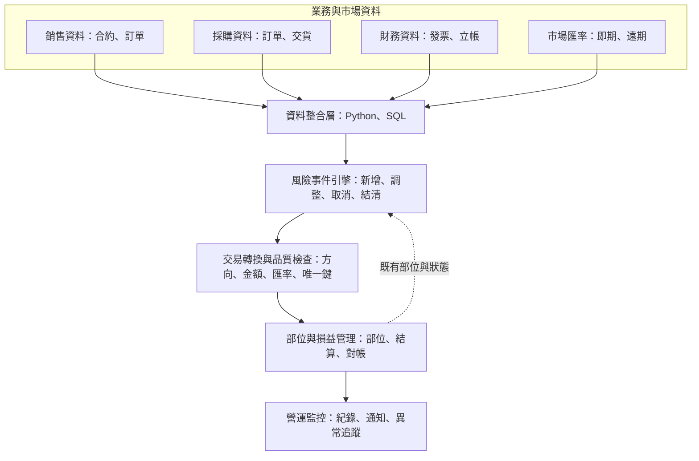

# 外匯風險自動拋轉系統

> 將分散在銷售、採購與財務系統中的業務事件，轉換為可自動計算、結清與追蹤的外匯風險部位。

## 專案摘要

企業從外幣銷售合約或採購訂單成立，到應收／應付帳款正式立帳之間，會持續承擔匯率波動風險。過去相關資料分散於不同部門與系統，風險認定、金額調整及結清需要大量人工比對，難以維持一致性與即時性。

本專案將銷售、採購、發票及市場匯率資料整合，依據合約成立、金額變更、取消、立帳與差異調整等事件，自動產生標準化交易資料，交由既有的部位與損益管理系統計算及監控。

我在專案中負責需求釐清、風險規則定義、跨系統資料整合、Python／SQL 資料流程，以及跨部門協作。系統目前支援每月約 **1.5 億美元**之外匯風險處理規模。

## 專案資訊

| 項目 | 說明 |
|---|---|
| 業務領域 | 外匯風險管理、銷售、採購、財務 |
| 專案角色 | 專案主導、業務分析、資料流程開發 |
| 核心使用者 | 風險管理與財務相關人員 |
| 主要技術 | Python、SQL、Pandas、關聯式資料庫、自動化排程 |
| 管理規模 | 每月約 1.5 億美元之外匯風險 |

## 業務問題

外匯風險不是在發票立帳後才出現，而是在外幣合約或採購訂單成立時就已產生，且會隨後續業務事件不斷變化：

- 合約或採購單成立時，產生新的風險部位。
- 金額或數量變更時，需要補足或沖回部位差額。
- 合約或採購單取消時，需要結清剩餘部位。
- 發票立帳時，需要依實際立帳金額及會計匯率結清。
- 預估金額與實際立帳金額不一致時，需要處理殘餘差異。

若各部門使用不同的資料來源或判斷方式，容易造成部位重複、漏拋、未完全結清或損益歸屬不一致。因此，專案重點是建立一套跨部門共同認可、可稽核且可重複執行的風險事件規則。

## 我的角色與責任

- 與風險管理團隊共同定義外匯風險範圍、事件與計算規則。
- 協調銷售、採購、財務及資訊相關單位，確認資料定義與關聯方式。
- 使用 Python 與 SQL 建立跨系統資料擷取、清理、比對及轉換流程。
- 將業務事件轉換成部位管理系統可接收的標準交易格式。
- 建立結清、殘餘差異調整、重複寫入防護及異常通知機制。
- 維護公開市場匯率資料的自動取得與完整性檢查流程。

> 部位評價與損益計算由既有的部位管理系統負責；本專案的核心貢獻是風險定義、跨系統資料整合、事件判斷與自動拋轉。

## 系統架構

下圖使用去識別化名稱呈現資料流，未包含公司內部系統、資料表及連線資訊。

詳細說明請見 [系統架構圖](docs/architecture.md)。

## 核心業務邏輯

### 風險期間

| 類型 | 風險起點 | 風險終點 |
|---|---|---|
| 銷售 | 外幣銷售合約成立 | 應收帳款立帳 |
| 採購 | 外幣採購訂單成立 | 應付帳款立帳 |

### 事件與部位處理

| 業務事件 | 系統判斷 | 部位處理 |
|---|---|---|
| 合約／採購單成立 | 符合幣別、交易型態及未立帳等條件 | 建立新部位 |
| 金額或數量增加 | 來源系統金額大於既有部位金額 | 補足差額 |
| 金額或數量減少 | 來源系統金額小於既有部位金額 | 沖回差額 |
| 合約／採購單取消 | 來源單據已刪除、駁回或結案 | 結清剩餘部位 |
| 發票立帳 | 單據與發票成功關聯，且尚有未結部位 | 依實際立帳金額結清 |
| 立帳後仍有差異 | 預估金額與實際金額不一致 | 產生調整項，使部位歸零 |

### 匯率選擇

系統依幣別、業務事件、交易方向及風險天期，選擇即期或遠期匯率；立帳結清則使用實際會計匯率。詳細帳號、天期與內部交易規則屬公司營運資訊，因此未於公開版本揭露。

## 資料處理流程

1. **擷取資料**：取得銷售合約、採購訂單、發票立帳、匯率及既有部位資料。
2. **標準化資料**：統一日期、幣別、單號、項次與金額格式，建立可跨系統比對的業務鍵。
3. **比對狀態**：比較來源單據與既有部位，辨識新增、變更、取消及結清事件。
4. **套用規則**：依事件、幣別及方向決定交易金額、買賣方向與適用匯率。
5. **產生交易**：轉換為部位管理系統所需格式，建立唯一識別碼以避免重複寫入。
6. **寫入與對帳**：更新交易、結清與狀態資料，確認來源金額與剩餘部位一致。
7. **監控結果**：保存執行紀錄，並將成功摘要或異常訊息推送給維運人員。

## 關鍵設計

### 1. 以事件建模，而不是只搬移資料

系統不是把合約與發票原封不動寫入另一個資料庫，而是先判斷業務狀態的變化，再產生對應的風險交易。這讓相同流程可以處理新增、修改、取消、部分立帳與完全結清等不同情境。

### 2. 來源資料與既有部位雙向比對

每次執行除了讀取來源系統，也會查詢既有部位與交易歷史。透過兩側差集及金額差異判斷，降低重複拋轉、漏拋及已結清部位再次處理的風險。

### 3. 業務規則與輸出格式分離

事件判斷、匯率選擇與金額計算集中於規則層；部位系統欄位與交易格式則由轉換層負責。當業務規則或下游格式改變時，可以縮小修改範圍。

### 4. 例外狀況納入正式流程

系統處理合約取消、金額變更、部分結清、預估與實際差異，以及匯率資料缺漏等情境。失敗時保留紀錄並主動通知，讓維運人員能快速追蹤。

## 專案成果

- 支援每月約 **1.5 億美元**之外匯風險自動處理。
- 將銷售、採購、財務與市場資料整合為一致的風險判斷流程。
- 將跨部門認定規則轉化為可執行、可追蹤的系統邏輯。
- 減少人工彙整、重複輸入與逐筆判斷，提升作業一致性。
- 讓風險部位、結清與損益可由集中平台持續監控。
- 建立錯誤通知與執行紀錄，提升日常維運的可追溯性。

## 挑戰與解法

| 挑戰 | 解法 |
|---|---|
| 不同系統的資料粒度及識別欄位不同 | 建立合約、訂單、發票之間的關聯鍵與標準化規則 |
| 部位會隨多種業務事件持續變動 | 將流程拆成新增、調整、取消、結清與殘餘調整事件 |
| 排程重跑可能造成重複交易 | 使用既有部位、交易歷史與唯一鍵進行重複寫入防護 |
| 預估金額與立帳金額可能不一致 | 設計差異調整與完全結清規則，避免殘留部位 |
| 匯率來源可能延遲或缺漏 | 加入資料完整性檢查、備援讀取與異常通知 |

## 使用技術

| 技術 | 用途 |
|---|---|
| Python／Pandas | 資料清理、關聯比對、事件判斷與交易轉換 |
| SQL／關聯式資料庫 | 跨系統資料擷取、交易寫入、部位查詢與對帳 |
| 網頁資料擷取 | 自動取得公開即期及遠期匯率資料 |
| 自動化排程 | 定期執行銷售、採購、結清與匯率更新流程 |
| 協作平台通知 | 傳送執行摘要、資料缺漏及錯誤訊息 |

## 後續精進方向

- 依預計收付款日動態選擇更精確的風險天期。
- 將資料品質指標與對帳結果集中至監控儀表板。
- 強化規則設定化，降低新增幣別或業務情境時的修改成本。
- 建立歷史事件重播與自動化測試，提高規則調整的可靠性。

## 資料與保密說明

本案例依實際專案重新整理，僅呈現業務問題、分析方法與去識別化架構。公開內容未包含任職公司的原始資料、實際單號、客戶或供應商資訊、帳號、連線設定、內部資料表名稱、完整程式碼及專用交易參數。
