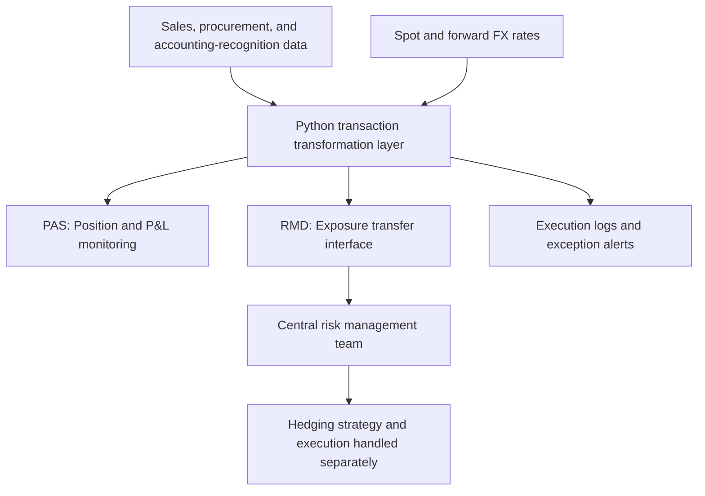

**English** | [繁體中文](README_ZH-TW.md)

# Automated Pre-Recognition FX Exposure Transfer System

## Objective

Move FX risk management upstream—from the recognition of accounts receivable and accounts payable to the point when foreign-currency sales contracts and purchase commitments are confirmed—so that exposures arising before accounting recognition can be identified, monitored, and managed.

Built around a clear governance principle—the business unit focuses on core operations while FX risk is managed centrally—the solution converts fragmented data from sales, procurement, and finance systems into standardized exposure-transfer transactions. This creates an end-to-end control process spanning exposure origination, internal position monitoring, and formal transfer to the central risk management team.

## Outcomes

| Area | Project Outcome |
|---|---|
| Risk management coverage | Established controls for pre-recognition FX exposures across USD- and EUR-denominated sales contracts, as well as USD-denominated purchases of steel coils, alloys, and other raw materials |
| Automation scale | Automates approximately USD 100 million in combined monthly FX exposure transfers across sales and procurement |
| Straight-through processing | Consolidates data, evaluates business events, generates transactions, and posts to downstream systems each day, with manual intervention limited to exceptions |
| Risk governance | Enables the business unit to monitor positions and P&L while centralizing FX risk ownership within the risk management team |
| Production track record | Has operated reliably in production for more than four years |

> The approximately USD 100 million represents aggregate monthly transfer transaction volume across sales and procurement; it is not the outstanding FX exposure at any single point in time.

## Approach

### 1. Codify Risk Management Principles into Executable Rules

In partnership with the risk management team, the project defined risk ownership, coverage windows, applicable currencies, and exchange-rate conventions, then translated these cross-functional policies into consistent data criteria and transaction logic.

For sales, the coverage window begins when a foreign-currency contract is confirmed and ends when the corresponding accounts receivable is recognized. For procurement, it begins when a foreign-currency purchase commitment is established and ends when the corresponding accounts payable is recognized.

### 2. Detect Business Events and Generate Transfer Transactions

The processing pipeline integrates sales, procurement, accounting-recognition, exchange-rate, and existing-position data. By comparing changes in business status and transaction amounts, it automatically detects exposure inception, amount adjustments, cancellations, and close-out upon accounting recognition, then generates standardized exposure-transfer transactions.

Managing the full exposure lifecycle allows the system to continuously reflect changes in the underlying business rather than relying on a static, point-in-time position snapshot.

### 3. Build Parallel Downstream Integrations and Exception Controls

Once transactions are generated, the system posts them automatically to two downstream destinations in parallel:

- PAS, which enables the business unit to monitor positions and P&L and supports month-end settlement and reporting.
- RMD interface tables, through which exposure information is formally transferred to the risk management team.

The system also maintains execution logs and sends exception alerts, enabling straight-through daily processing while limiting operational intervention to issues such as missing data or failed runs.

> **Terminology:** PAS is an existing position management system that calculates positions and P&L from transaction records. RMD refers to the interface tables used to exchange exposure-transfer transaction data with the risk management team.

## Architecture

```mermaid
flowchart TB
    A["Sales, procurement, and accounting-recognition data"] --> D["Python transaction transformation layer"]
    B["Spot and forward FX rates"] --> D

    D --> E["PAS: Position and P&L monitoring"]
    D --> F["RMD: Exposure transfer interface"]
    D --> G["Execution logs and exception alerts"]

    F --> H["Central risk management team"]
    H --> I["Hedging strategy and execution handled separately"]
```

The Python transaction transformation layer is the core of the architecture. It handles cross-system data integration, state-change comparison, business-event evaluation, transaction generation, and data validation.

PAS and RMD are parallel outputs with distinct roles: PAS supports internal position and P&L management within the business unit, while RMD serves as the interface for transferring exposure information to the risk management team. The system's scope ends once the exposure information has been transferred; hedging strategy and trade execution remain the responsibility of the risk management team.

## Technology

| Category | Technology / Tool | Project Application |
|---|---|---|
| Programming and data processing | Python | Cross-system data integration, business-event evaluation, amount calculation, and transaction generation |
| Database integration | SQL Server, SQL | Reads business and accounting-recognition data and writes interface records to PAS and RMD |
| Web automation | Selenium | Automatically retrieves external forward FX rates |
| Scheduling and monitoring | Windows Task Scheduler, Microsoft Teams | Runs the daily batch process and sends run-status and exception notifications |
