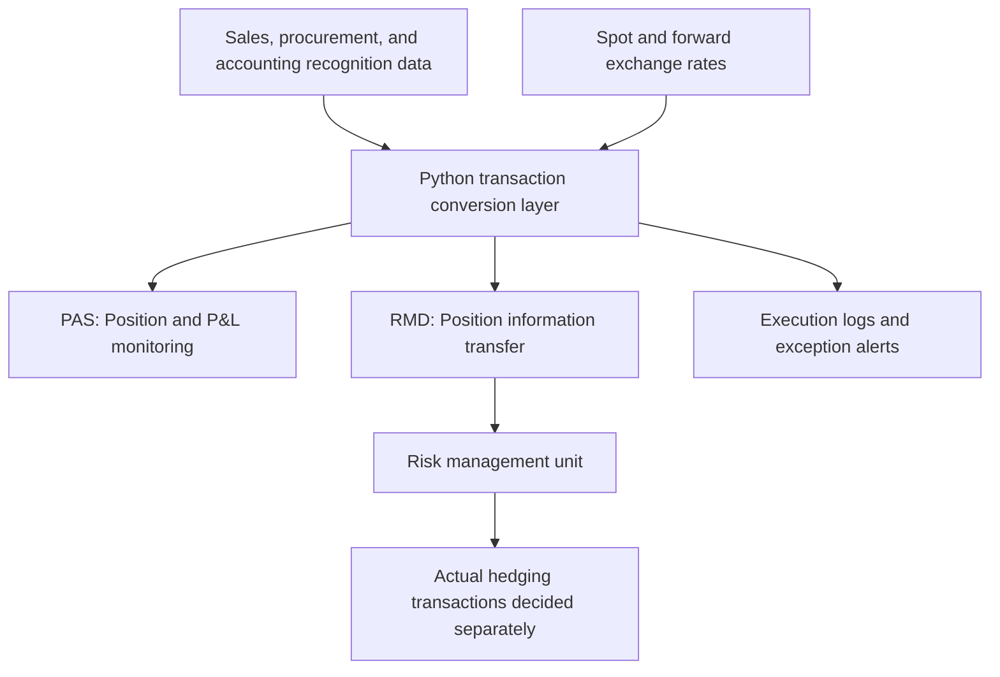

**English** | [繁體中文](README_ZH-TW.md)

# Automated Pre-Recognition FX Risk Position Transfer System

## Objective

Extend the FX risk management window from the recognition dates of accounts receivable and accounts payable back to the confirmation dates of foreign-currency sales contracts and purchases, enabling FX exposures that arise before accounting recognition to be identified, tracked, and managed.

Following the governance principle that business units should focus on core operations while FX risk is centrally managed by the risk management unit, the system automatically converts business information distributed across sales, procurement, and finance systems into standardized position transaction records. This establishes an end-to-end process spanning risk origination, position monitoring, and cross-functional position transfer.

## Outcomes

| Area | Project Outcome |
|---|---|
| Risk management coverage | Established a pre-recognition FX risk management mechanism covering USD- and EUR-denominated sales contracts, as well as USD-denominated purchases of steel coils, alloys, and other materials |
| Automation scale | Transfers approximately USD 100 million in combined sales- and procurement-side transaction volume per month |
| Operational automation | Automatically performs daily data integration, business event identification, transaction generation, and system posting; manual intervention is required only for exceptions |
| Management framework | Supports both internal position and P&L monitoring within the business unit and centralized FX risk ownership by the risk management unit |
| System reliability | Has operated reliably in production for more than four years |

> The approximately USD 100 million per month represents the combined position-transfer transaction volume across sales and procurement. It is not the outstanding FX position at a single point in time.

## Approach

### 1. Translate Risk Management Principles into Executable Rules

Worked with the risk management unit to define risk ownership, management periods, applicable currencies, and exchange-rate rules, then translated these cross-functional principles into consistent data conditions and transaction logic.

For sales, the risk management period begins when a foreign-currency contract is confirmed and ends when the corresponding accounts receivable is recognized. For procurement, it begins when a foreign-currency purchase is confirmed and ends when the corresponding accounts payable is recognized.

### 2. Build Business Event Identification and Transaction Conversion

Integrated sales, procurement, accounting recognition, exchange-rate, and existing position data. Based on changes in business status and transaction amounts, the system automatically identifies position openings, amount adjustments, cancellations, and settlement upon accounting recognition, then converts each event into standardized position-transfer transaction records.

By managing the full risk lifecycle, the system continuously reflects business changes instead of retaining only a point-in-time position snapshot.

### 3. Establish Parallel Outputs and Exception Management

Once transaction records are generated, the system automatically writes them to two management endpoints in parallel:

- PAS, enabling the business unit to monitor positions and P&L and complete month-end settlement.
- RMD interface tables, transferring position information to the risk management unit.

The system also retains execution logs and sends exception notifications, allowing daily processing to remain fully automated while operations staff intervene only when issues such as missing data or execution failures occur.

> Terminology: PAS is an existing position management system that calculates positions and P&L from transaction records. RMD refers to the interface tables used to exchange position-transfer transaction information with the risk management unit.

## Architecture

```mermaid
flowchart TB
    A["Sales, procurement, and accounting recognition data"] --> D["Python transaction conversion layer"]
    B["Spot and forward exchange rates"] --> D

    D --> E["PAS: Position and P&L monitoring"]
    D --> F["RMD: Position information transfer"]
    D --> G["Execution logs and exception alerts"]

    F --> H["Risk management unit"]
    H --> I["Actual hedging transactions decided separately"]
```

The Python transaction conversion layer is the core of the architecture. It is responsible for cross-system data integration, status-difference comparison, risk event identification, transaction generation, and data validation.

PAS and RMD are parallel outputs. PAS supports internal position and P&L management within the business unit, while RMD serves as the interface through which the business unit transfers position information to the risk management unit. After the system completes the position information transfer, the risk management unit separately determines and executes the actual hedging strategy and transactions.

## Technology

| Category | Technology / Tool | Project Application |
|---|---|---|
| Programming and data processing | Python | Cross-system data integration, event identification, amount calculation, and transaction generation |
| Database integration | SQL Server, SQL | Reads business and accounting recognition data and writes interface data to PAS and RMD |
| Web automation | Selenium | Automatically retrieves external forward exchange rates |
| Scheduling and monitoring | Windows Task Scheduler, Teams | Runs the daily batch process and sends execution results and exception notifications |
