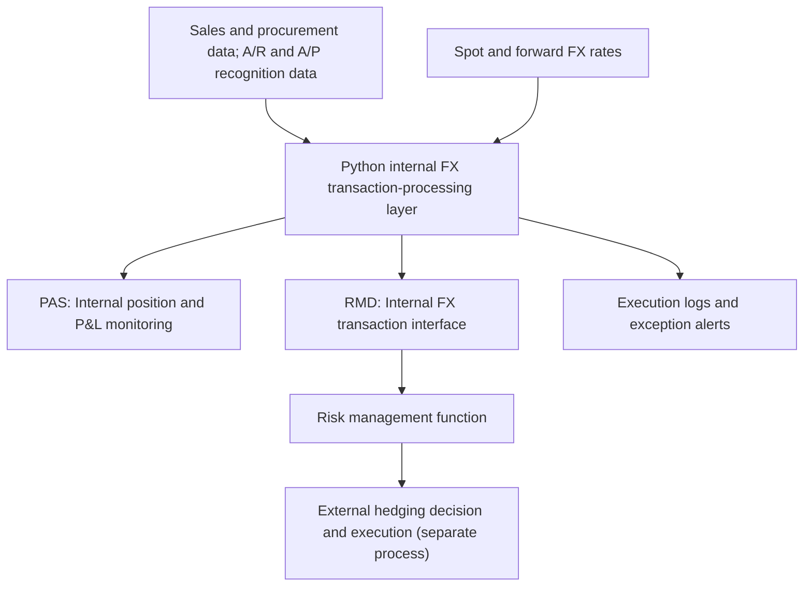

**English** | [繁體中文](README_ZH-TW.md)

# Pre-Recognition FX Exposure Management and Internal Transfer Automation

## Objective

Move FX exposure management upstream—from the recognition of accounts receivable and accounts payable to the point when foreign-currency sales contracts and purchase commitments are confirmed—so that exposures arising before accounting recognition can be identified, monitored, and managed.

Under a governance model in which the business unit focuses on core operations and the risk management function centrally manages FX risk, the solution converts fragmented sales, procurement, and finance data into standardized internal FX transactions. These transactions formalize the internal transfer of identified exposures from the business unit to the risk management function, creating an end-to-end control process spanning exposure origination, business-unit position monitoring, and centralized risk management. Whether to hedge the transferred exposures in external markets is a separate decision made by the risk management function.

## Outcomes

| Area | Project Outcome |
|---|---|
| Risk management coverage | Established controls for pre-recognition FX exposures across USD- and EUR-denominated sales contracts, as well as USD-denominated purchases of steel coils, alloys, and other raw materials |
| Automation scale | Processes approximately USD 100 million of internal FX transfer transactions each month across sales and procurement |
| Daily automated processing | Consolidates data, evaluates business events, generates internal FX transactions, and posts them to downstream systems each day, with manual intervention limited to exceptions |
| Risk governance | Enables the business unit to monitor internal positions and P&L while routing identified exposures to the risk management function through internal FX transactions; any decision to hedge externally remains outside the system |
| Production track record | Has operated reliably in production for more than four years |

> The approximately USD 100 million represents aggregate monthly internal transfer transaction volume across sales and procurement; it is not the outstanding FX exposure at any single point in time.

## Approach

### 1. Translate Risk Management Principles into Internal Transfer Rules

In partnership with the risk management function, the project defined risk ownership, exposure management periods, applicable currencies, and exchange-rate conventions, then translated these cross-functional policies into consistent data rules and transaction logic for internal FX transfers.

For sales, the exposure management period begins when a foreign-currency contract is confirmed and ends when the corresponding accounts receivable is recognized. For procurement, it begins when a foreign-currency purchase commitment is established and ends when the corresponding accounts payable is recognized.

### 2. Detect Business Events and Generate Internal FX Transactions

The processing pipeline integrates sales, procurement, A/R and A/P recognition, exchange-rate, and existing-position data. By comparing changes in business status and transaction amounts, it automatically detects exposure inception, amount adjustments, cancellations, and close-out upon accounting recognition, then generates standardized internal FX transfer transactions.

Managing the full exposure lifecycle allows the system to continuously reflect changes in the underlying business rather than relying on a static, point-in-time position snapshot.

### 3. Build Parallel Downstream Integrations and Exception Controls

Once transactions are generated, the system posts them automatically to two internal destinations in parallel:

- PAS, which enables the business unit to monitor internal FX positions and P&L and supports month-end close and reporting.
- RMD interface tables, which transmit internal FX transaction records to the risk management function and complete the internal transfer process.

The system also maintains execution logs and sends exception alerts, enabling automated daily processing while limiting operational intervention to issues such as missing data or failed runs.

> **Terminology:** PAS is an existing position management system that calculates internal positions and P&L from transaction records. RMD refers to the interface tables used to exchange internal FX transfer transaction data with the risk management function.

## Architecture

```mermaid
flowchart TB
    A["Sales and procurement data; A/R and A/P recognition data"] --> D["Python internal FX transaction-processing layer"]
    B["Spot and forward FX rates"] --> D

    D --> E["PAS: Internal position and P&L monitoring"]
    D --> F["RMD: Internal FX transaction interface"]
    D --> G["Execution logs and exception alerts"]

    F --> H["Risk management function"]
    H --> I["External hedging decision and execution (separate process)"]
```

The Python internal FX transaction-processing layer is the core of the architecture. It handles cross-system data integration, state-change comparison, business-event evaluation, transaction generation, and data validation.

All transactions generated by this system are internal. PAS supports position and P&L monitoring within the business unit, while RMD transfers internal FX transaction data to the risk management function. The system's scope ends when the internal transfer is completed through RMD. The risk management function independently determines whether, when, and how to hedge the exposures in external markets.

## Technology

| Category | Technology / Tool | Project Application |
|---|---|---|
| Programming and data processing | Python | Cross-system data integration, business-event evaluation, amount calculation, and internal FX transaction generation |
| Database integration | SQL Server, SQL | Reads business data plus A/R and A/P recognition records and writes internal transaction records to PAS and RMD |
| Web automation | Selenium | Automatically retrieves external forward FX rates |
| Scheduling and monitoring | Windows Task Scheduler, Microsoft Teams | Runs the daily batch process and sends run-status and exception notifications |
