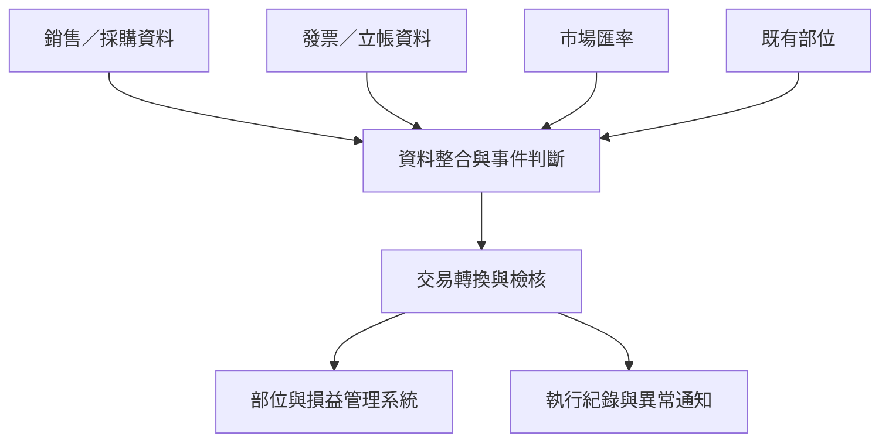

[English](README.md) | **繁體中文**

# 外匯風險自動拋轉系統

建立一致且可追溯的外匯風險管理流程，讓銷售、採購與財務事件能即時反映於風險部位，提升風險認列、結清與對帳的準確性。系統整合合約、採購、發票、匯率及既有部位資料，自動處理部位建立、調整與結清，每月自動拋轉的外匯交易總金額約 **1 億美元**。

## 專案概況

| 項目 | 說明 |
|---|---|
| 業務範圍 | 銷售、採購、財務及外匯風險管理 |
| 個人職責 | 使用者與作業需求釐清、規則設計、資料整合、流程開發 |
| 使用技術 | Python、Pandas、SQL、關聯式資料庫、自動排程 |
| 每月處理量 | 自動拋轉的外匯交易總金額約 1 億美元 |

## 問題

外幣合約或採購單成立後，即產生匯率風險；後續金額異動、取消及發票立帳，皆會改變風險部位。原流程資料分散於多個系統，仰賴人工比對，容易發生漏拋、重複拋轉或結清不完整。

## 作法

1. 整合合約、採購、發票、匯率及既有部位資料。
2. 統一日期、幣別、單號、項次與金額格式。
3. 比對來源單據與既有部位，辨識新增、異動、取消及立帳事件。
4. 依事件與風險期間決定金額、方向及適用匯率。
5. 產生下游系統所需交易資料，並以唯一鍵防止重複寫入。
6. 保存執行紀錄；資料缺漏或處理失敗時主動通知。

## 業務規則

| 業務事件 | 部位處理 |
|---|---|
| 合約／採購單成立 | 建立部位 |
| 金額或數量增加 | 補足差額 |
| 金額或數量減少 | 沖回差額 |
| 合約／採購單取消 | 結清剩餘部位 |
| 發票立帳 | 依實際金額及會計匯率結清 |
| 立帳後仍有差異 | 建立調整項，使部位歸零 |

風險期間如下：

- 銷售：外幣合約成立至應收帳款立帳。
- 採購：外幣採購單成立至應付帳款立帳。

部位評價與損益計算由既有系統負責；本專案負責風險事件判斷、資料整合與交易拋轉。

## 系統架構

詳細資料流與事件設計請見 [系統架構](docs/architecture.md)。

## 個人貢獻

- 與風險管理單位定義風險範圍、事件及計算規則。
- 協調銷售、採購、財務及資訊單位確認資料定義。
- 建立跨系統資料擷取、清理、比對及轉換流程。
- 設計結清、差異調整、重複寫入防護及異常通知機制。
- 維護市場匯率資料的自動取得及完整性檢查。

## 成果

- 每月自動拋轉約 **1 億美元的外匯交易總金額**。
- 統一跨部門風險認定、匯率及結清規則。
- 減少人工彙整與逐筆判斷，提高作業一致性。
- 保留交易及執行紀錄，提升對帳與問題追溯效率。

## 保密說明

本案例僅呈現去識別化的業務問題、處理邏輯與系統架構，不含公司原始資料、交易參數、連線資訊、內部資料表名稱及完整程式碼。
