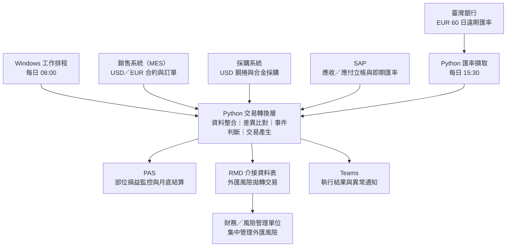

[English](README.md) | **繁體中文**

# 立帳前外匯風險自動拋轉系統

## 目的

外幣銷售合約或採購成立後，企業便開始承擔匯率變動的影響，但應收、應付帳款通常於後續作業階段才會正式立帳。

本專案將外匯風險管理時點向前延伸至銷售合約及外幣採購成立日，透過每日自動辨識與交易轉換，讓立帳前已形成的外幣曝險能及早納入管理。

系統依循「事業群聚焦本業經營、外匯風險由財務／風險管理單位集中管理」的治理原則，將分散於銷售、採購及財務系統中的業務資訊轉換為標準交易，同時支援：

- 事業群透過 PAS 監控部位損益並執行月底結算。
- 財務／風險管理單位透過 RMD 介接資訊承接外匯風險。

## 成果

| 管理面向 | 專案成果 |
|---|---|
| 風險管理時點 | 將外匯風險納管時間提前至銷售合約或外幣採購成立日，涵蓋帳款立帳前的風險期間 |
| 自動化規模 | 銷售端與採購端每月累計拋轉交易金額約 1 億美元 |
| 業務涵蓋範圍 | 涵蓋美元、歐元銷售合約，以及鋼捲、合金等美元採購 |
| 風險生命週期 | 持續管理部位建立、金額調整、取消、立帳結清及差異調整 |
| 跨單位協作 | 建立事業群與財務／風管單位之間一致且可追溯的交易資訊交換流程 |
| 正式運行 | 系統已正式上線並穩定運行超過四年 |

> 每月約 1 億美元為銷售端與採購端的合計拋轉交易量，不代表單一時點的未結外匯部位。

## 作法

### 1. 將外匯管理原則轉換為系統規則

與財務／風險管理單位共同釐清風險歸屬、管理期間、適用幣別及匯率規則，將外匯治理原則轉換為可由系統執行的資料條件與交易邏輯。

| 業務流程 | 風險管理起點 | 風險管理終點 | 管理範圍 |
|---|---|---|---|
| 銷售端 | 銷售合約成立 | 應收帳款立帳 | 美元、歐元銷售合約 |
| 採購端 | 外幣採購成立 | 應付帳款立帳 | 鋼捲、合金等美元採購 |

系統依不同幣別與業務事件，分別套用即期匯率、立帳匯率或遠期匯率，使銷售、採購與財務端採用一致的交易計算口徑。

### 2. 以業務事件管理風險部位生命週期

Python 程式每日上午 8:00 整合前一日的銷售、採購、立帳及匯率資料，比對最新業務狀態與既有交易，辨識風險部位的變動，再產生對應的交易。

| 業務事件 | 交易處理 |
|---|---|
| 合約或採購成立 | 建立新的風險部位 |
| 金額增加 | 針對增加金額產生新增交易 |
| 金額減少 | 釋放相對應的風險部位 |
| 合約或採購取消 | 沖轉尚未結清的部位 |
| 應收或應付帳款立帳 | 依實際立帳金額與匯率進行結清 |
| 預估與實際金額產生差異 | 產生差異調整交易，使部位完整結清 |

歐元遠期匯率由獨立程式於每日下午 3:30 自動取得臺灣銀行公告的 60 日遠期匯率，提供後續交易計算使用。

透過事件差異產生交易，系統管理的是每一筆風險從形成、變動到結清的完整過程，而不只是單日資料快照。

### 3. 建立部位管理與風險拋轉的雙軌流程

交易轉換完成後，同一套處理結果同步提供兩項管理用途：

- 寫入 PAS，供事業群進行部位損益監控及月底結算。
- 寫入 RMD 介接資料表，將拋轉交易提供財務／風險管理單位集中管理。

系統另透過 Teams 發送每日執行結果與異常通知，使維運人員能掌握處理筆數、執行狀態及待確認事項，形成從資料處理、交易拋轉到執行監控的完整自動化流程。

本專案由我負責系統架構規劃、業務與交易規則設計、Python 程式開發、跨系統介接、跨單位協調、測試上線及後續維運。PAS 沿用既有平台的部位損益計算能力；我主導上游交易轉換層，以及 PAS、RMD 兩條輸出流程的設計與落地。

## 架構

```mermaid
flowchart TB
    A["銷售系統（MES）<br/>USD／EUR 合約與訂單"]
    B["採購系統<br/>USD 鋼捲與合金採購"]
    C["SAP<br/>應收／應付立帳與即期匯率"]
    D["臺灣銀行<br/>EUR 60 日遠期匯率"]

    D --> E["Python 匯率擷取<br/>每日 15:30"]

    G["Windows 工作排程<br/>每日 08:00"] --> F
    A --> F
    B --> F
    C --> F
    E --> F

    F["Python 交易轉換層<br/>資料整合｜差異比對｜事件判斷｜交易產生"]

    F --> H["PAS<br/>部位損益監控與月底結算"]
    F --> I["RMD 介接資料表<br/>外匯風險拋轉交易"]
    I --> J["財務／風險管理單位<br/>集中管理外匯風險"]
    F --> K["Teams<br/>執行結果與異常通知"]
```

Python 交易轉換層是整體架構的核心，負責將不同系統中的業務資料轉換為一致的外匯交易。處理結果採平行輸出：PAS 支援事業群內部的部位管理，RMD 則承接事業群與財務／風管單位之間的拋轉資訊交換。

## 技術

| 範疇 | 技術／工具 | 專案應用 |
|---|---|---|
| 程式開發 | Python | 實作每日批次流程、業務規則、事件判斷及交易產生 |
| 資料處理 | Pandas | 整合跨系統資料、比對狀態差異與計算交易金額 |
| 資料庫介接 | SQL Server、pyodbc | 讀取銷售、採購及立帳資料，並寫入 PAS 與 RMD 介接資料 |
| 網頁自動化 | Selenium | 自動取得臺灣銀行公告的歐元遠期匯率 |
| 排程自動化 | Windows 工作排程器 | 執行每日交易處理及遠期匯率擷取程式 |
| 部位管理 | PAS | 支援事業群部位損益監控與月底結算 |
| 風險資訊介接 | RMD 介接資料表 | 將標準化拋轉交易提供財務／風險管理單位 |
| 執行監控 | Teams | 發送每日執行結果、處理狀態及異常通知 |
