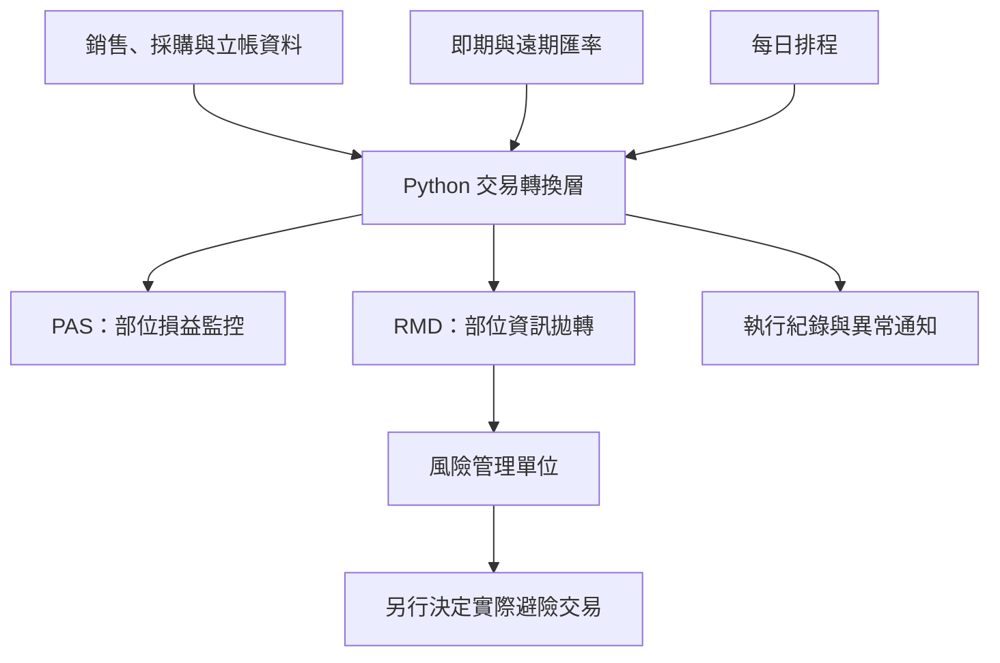

[English](README.md) | **繁體中文**

# 立帳前外匯風險自動拋轉系統

## 目的

將外匯風險管理時點由應收、應付帳款立帳日，向前延伸至外幣銷售合約及採購成立日，使立帳前已形成的匯率風險也能被辨識、追蹤與管理。

本專案依循「事業群聚焦本業經營，外匯風險由風險管理單位集中管理」的治理原則，將分散於銷售、採購及財務系統中的業務資訊，自動轉換為標準化的部位交易資訊，建立從風險形成、部位監控到跨單位拋轉的完整流程。

## 成果

| 面向 | 專案成果 |
|---|---|
| 風險管理範圍 | 建立立帳前外匯風險管理機制，涵蓋美元、歐元銷售合約，以及鋼捲、合金等美元採購 |
| 自動化規模 | 銷售端與採購端每月合計拋轉交易量約 1 億美元 |
| 作業自動化 | 每日自動完成資料整合、事件判斷、交易產生及系統寫入，人工僅需處理異常 |
| 管理機制 | 同時支援事業群內部部位損益監控，以及風管單位集中承接外匯風險 |
| 系統穩定性 | 系統正式上線並穩定運行超過四年 |

> 每月約 1 億美元是銷售端與採購端的合計拋轉交易量，並非單一時點的未結外匯部位。

## 作法

### 1. 將風險管理原則轉換為可執行規則

與風險管理單位共同定義風險歸屬、管理期間、適用幣別及匯率規則，並將跨部門的管理原則轉換為一致的資料條件與交易邏輯。

銷售端的管理期間由外幣合約成立開始，至應收帳款立帳為止；採購端則由外幣採購成立開始，至應付帳款立帳為止。

### 2. 建立事件驅動的交易轉換流程

整合銷售、採購、立帳、匯率及既有部位資訊，依業務狀態與金額差異，自動辨識部位建立、金額調整、取消及立帳結清等事件，再轉換為標準化的拋轉交易資訊。

透過完整的風險生命週期管理，系統能持續反映業務變動，而非僅保存單一時間點的部位快照。

### 3. 建立平行輸出與異常管理機制

交易資訊產生後，由系統全自動寫入兩個管理端點：

- 寫入 PAS，供事業群監控部位損益及進行月底結算。
- 寫入 RMD 介接資料表，將部位資訊拋轉至風險管理單位。

系統同步保留執行紀錄並發送異常通知，使日常流程維持自動運作，維運人員僅需介入處理資料缺漏或執行失敗等例外情況。

本專案由我負責系統架構規劃、風險與交易規則設計、Python 程式開發、跨系統介接、跨單位協調、測試上線及後續維運。PAS 為既有部位管理平台；我主導上游交易轉換層，以及 PAS、RMD 兩條輸出流程的設計與落地。

## 架構

```mermaid
flowchart TB
    A["銷售、採購與立帳資料"] --> D["Python 交易轉換層"]
    B["即期與遠期匯率"] --> D
    C["每日排程"] --> D

    D --> E["PAS：部位損益監控"]
    D --> F["RMD：部位資訊拋轉"]
    D --> G["執行紀錄與異常通知"]

    F --> H["風險管理單位"]
    H --> I["另行決定實際避險交易"]
```

Python 交易轉換層是整體架構的核心，負責跨系統資料整合、狀態差異比對、風險事件判斷、交易產生及資料驗證。

PAS 與 RMD 是兩條平行輸出：PAS 支援事業群內部的部位與損益管理；RMD 則是事業群向風險管理單位拋轉部位資訊的介接點。本系統完成部位資訊拋轉後，實際避險策略與交易仍由風管單位另行決定及執行。

## 技術

| 範疇 | 技術／工具 | 專案應用 |
|---|---|---|
| 程式與資料處理 | Python、Pandas | 跨系統資料整合、事件判斷、金額計算及交易產生 |
| 資料庫介接 | SQL Server、SQL、pyodbc | 讀取業務與立帳資料，並寫入 PAS、RMD 介接資料 |
| 網頁自動化 | Selenium | 自動取得外部遠期匯率資料 |
| 排程與監控 | Windows 工作排程器、Teams | 執行每日批次流程，發送執行結果及異常通知 |
| 系統整合 | PAS、RMD | 支援部位損益管理與跨單位風險資訊拋轉 |
