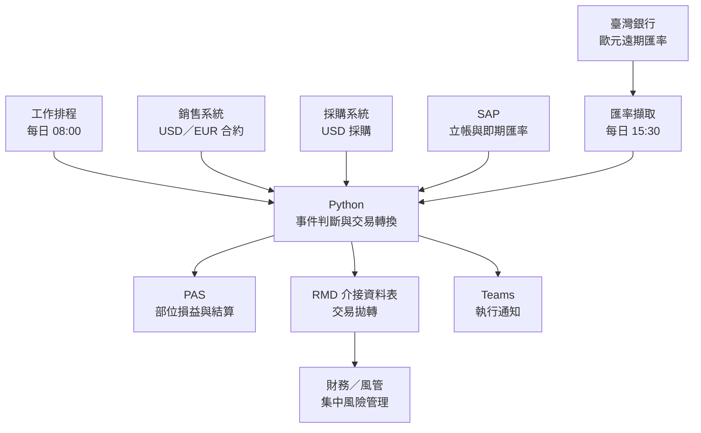

[English](README.md) | **繁體中文**

# 立帳前外匯風險自動拋轉系統

## 目的

銷售合約或外幣採購成立後，企業即可在應收或應付帳款正式立帳前啟動外匯風險管理。

基於事業群聚焦本業經營、外匯風險由財務／風險管理單位集中管理的原則，本專案建立立帳前外匯風險的自動辨識與拋轉機制。系統將銷售及採購資訊轉換為標準交易，讓已確認的外匯風險能及早納入財務風險管理流程。

同一套交易資訊亦同步寫入 PAS 部位管理系統，供事業群進行部位損益監控及月底結算，建立從業務事件、部位管理到風險拋轉的完整資訊流程。

## 成果

### 1. 將外匯風險管理提前至帳款立帳前

以銷售合約及外幣採購成立作為風險管理起點，透過每日自動辨識、計算及拋轉，使外匯風險能在應收或應付帳款正式立帳前，即納入企業的管理流程。

### 2. 建立銷售與採購一致的風險拋轉流程

整合美元、歐元銷售合約，以及鋼捲、合金等美元採購，將不同資料來源與業務生命週期中的事件轉換為一致的交易資訊。

交易結果採雙軌輸出：

- 寫入 PAS，支援事業群的部位損益監控與月底結算。
- 寫入 RMD 介接資料表，將拋轉資訊提供財務／風險管理單位集中管理。

### 3. 實現長期穩定且具規模的自動化運作

系統已正式上線並穩定運行超過四年，每日自動處理銷售與採購資料，每月累計拋轉交易金額約 **1 億美元**，持續支援事業群與財務／風管單位之間的外匯風險資訊交換。

> 金額口徑為採購端與銷售端的合計拋轉量，用於呈現每月交易處理規模；與單一時點的未結外匯部位屬於不同衡量口徑。

## 作法

本專案以既有 PAS 部位管理系統為基礎，在業務系統與財務風險管理流程之間建立交易轉換與系統介接層，延伸既有系統的應用範圍。

首先依據銷售與採購流程，定義立帳前外匯風險的管理期間：

| 流程 | 風險起點 | 風險終點 | 管理範圍 |
|---|---|---|---|
| 銷售端 | 銷售合約成立 | 應收帳款立帳 | 美元、歐元銷售合約 |
| 採購端 | 外幣採購成立 | 應付帳款立帳 | 鋼捲、合金等美元採購 |

Python 每日上午 8:00 整合前一日的銷售、採購及立帳資訊，辨識合約或採購成立、金額變動、取消、立帳及差異調整等事件，再轉換為新增、調整、沖轉或結清交易。

系統依幣別與事件類型套用即期匯率、立帳匯率或遠期匯率；歐元遠期匯率則由另一支程式於每日下午 3:30 自動取得臺灣銀行公告資料。

交易轉換完成後，同步支援兩項管理需求：

- PAS 提供事業群內部的部位損益監控與月底結算。
- RMD 介接資料表將拋轉交易資訊提供財務／風險管理單位。

系統另透過 Teams 發送每日執行結果與狀態通知，協助維運人員掌握自動化流程。

本專案中，我負責系統架構規劃、業務規則設計、Python 流程開發、跨單位協調、測試、正式上線及後續維運，並將銷售與採購資訊轉換為可供 PAS 與財務風管流程使用的標準交易資訊。

## 架構

交易資訊採雙軌方式輸出，各自支援不同的管理目的：PAS 用於事業群內部的部位損益監控與月底結算；RMD 介接資料表則作為事業群與財務／風管單位交換拋轉資訊的正式介面。

```mermaid
flowchart TB
    A["銷售系統<br/>USD／EUR 合約"]
    B["採購系統<br/>USD 採購"]
    C["SAP<br/>立帳與即期匯率"]
    D["臺灣銀行<br/>歐元遠期匯率"]

    D --> E["匯率擷取<br/>每日 15:30"]

    G["工作排程<br/>每日 08:00"] --> F["Python<br/>事件判斷與交易轉換"]
    A --> F
    B --> F
    C --> F
    E --> F

    F --> H["PAS<br/>部位損益與結算"]
    F --> I["RMD 介接資料表<br/>交易拋轉"]
    I --> J["財務／風管<br/>集中風險管理"]
    F --> K["Teams<br/>執行通知"]
```

## 技術

| 範疇 | 技術／工具 | 用途 |
|---|---|---|
| 資料整合與業務邏輯 | Python、Pandas | 整合跨系統資料、辨識風險事件並轉換為交易 |
| 資料庫與系統介接 | SQL Server、pyodbc | 讀取業務資料並更新 PAS 與 RMD 介接資料 |
| 市場匯率取得 | Selenium | 自動取得臺灣銀行遠期匯率 |
| 自動化排程 | Windows 工作排程器 | 執行每日交易處理與匯率擷取 |
| 部位管理 | PAS | 既有部位損益監控與月底結算系統 |
| 執行監控 | Teams | 發送每日執行結果與狀態通知 |
