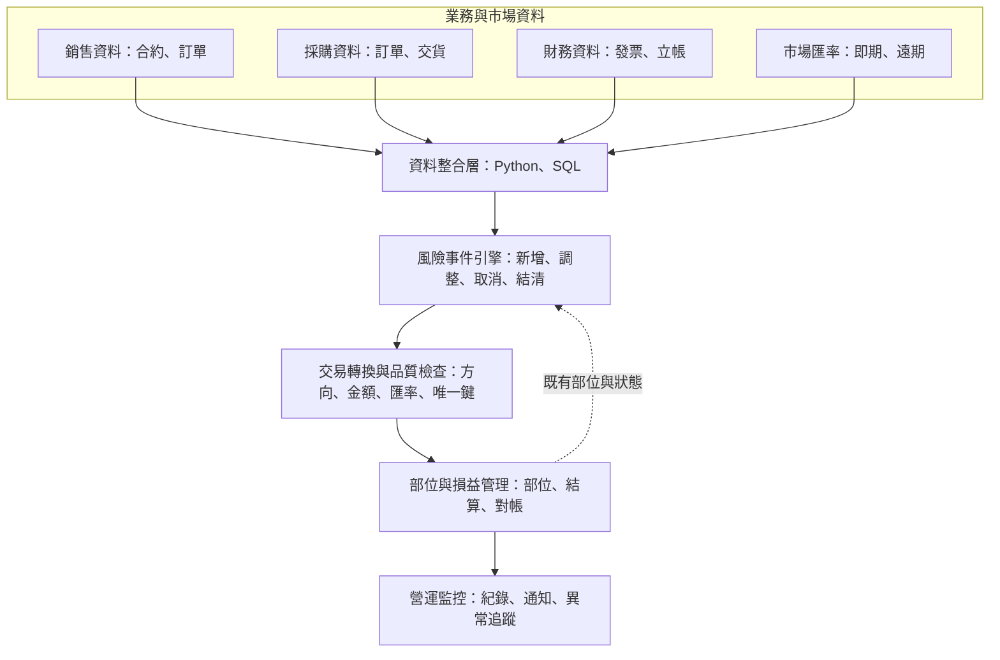
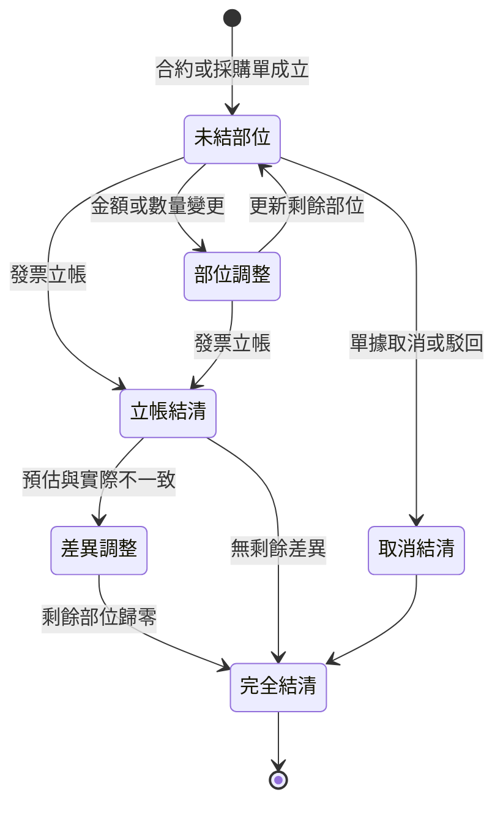

**繁體中文** | [English](architecture_en.md)

# 外匯風險自動拋轉系統｜架構圖

## 整體架構

## 各層職責

| 層級 | 主要職責 |
|---|---|
| 業務與市場資料 | 提供銷售、採購、立帳及匯率等來源資料 |
| 資料整合層 | 擷取、清理、標準化並關聯跨系統資料 |
| 風險事件引擎 | 比較來源資料與既有部位，辨識新增、調整、取消及結清事件 |
| 交易轉換與品質檢查 | 計算方向、金額與匯率，建立唯一鍵並驗證必要欄位 |
| 部位與損益管理 | 保存交易、計算未結部位及損益，提供對帳基礎 |
| 營運監控 | 保存執行紀錄，推送摘要、資料缺漏與失敗通知 |

## 事件生命週期

## 主要資料流

1. 從來源系統取得當期業務資料與立帳結果。
2. 從部位管理系統取得既有部位及交易歷史。
3. 標準化單號、項次、日期、幣別與金額。
4. 以來源狀態、既有部位與金額差異判斷事件。
5. 依事件與幣別套用買賣方向及匯率規則。
6. 轉換為標準交易格式並執行必要欄位與重複檢查。
7. 寫入部位管理系統，更新結清狀態並保存執行紀錄。
8. 將處理摘要或異常訊息推送給維運人員。

## 圖示說明

- 實線箭頭代表主要資料處理方向。
- 虛線箭頭代表既有部位與交易狀態回饋至事件判斷流程。
- 所有系統名稱均已去識別化，未呈現公司內部架構細節。
