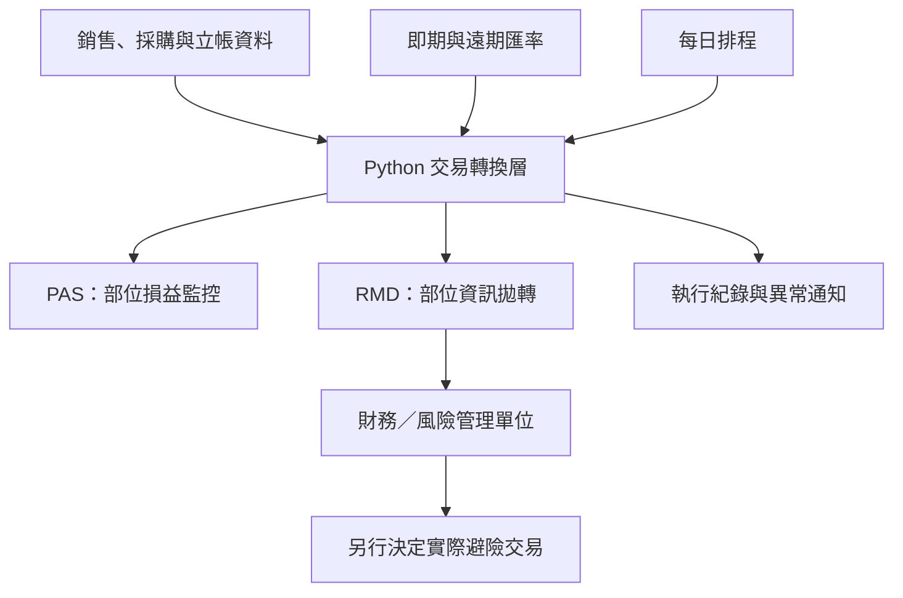

**繁體中文** | [English](architecture_en.md)

# 外匯風險自動拋轉系統｜系統架構

## 整體架構

```mermaid
flowchart TB
    A["銷售、採購與立帳資料"] --> D["Python 交易轉換層"]
    B["即期與遠期匯率"] --> D
    C["每日排程"] --> D

    D --> E["PAS：部位損益監控"]
    D --> F["RMD：部位資訊拋轉"]
    D --> G["執行紀錄與異常通知"]

    F --> H["財務／風險管理單位"]
    H --> I["另行決定實際避險交易"]
```

## 架構職責

| 架構層級 | 主要職責 |
|---|---|
| 來源資料 | 提供銷售、採購、立帳、即期匯率及遠期匯率資訊 |
| Python 交易轉換層 | 整合跨系統資料、比對狀態差異、判斷風險事件、產生交易並驗證資料 |
| PAS | 供事業群監控部位損益及進行月底結算 |
| RMD 介接資料表 | 將標準化部位交易資訊拋轉至財務／風險管理單位 |
| 執行紀錄與異常通知 | 保存批次處理結果，協助維運人員處理資料缺漏與執行失敗 |

## 核心設計

### 事件驅動的交易轉換

系統不是保存單一時間點的部位快照，而是依銷售合約、外幣採購及立帳狀態的變化，辨識部位建立、金額調整、取消與立帳結清等事件，再轉換為標準化交易。

### PAS 與 RMD 平行輸出

交易產生後，由 Python 交易轉換層分別寫入 PAS 與 RMD，兩者並非前後串接關係：

- PAS 支援事業群內部的部位與損益管理。
- RMD 是事業群與財務／風險管理單位交換部位資訊的介接點。

### 自動化邊界

本系統自動完成資料整合、交易產生及部位資訊拋轉，人工僅需處理異常。財務／風險管理單位取得拋轉資訊後，實際避險策略與交易仍由其另行決定及執行。

## 管理期間

| 業務流程 | 風險管理期間 |
|---|---|
| 銷售端 | 自外幣銷售合約成立起，至應收帳款立帳為止 |
| 採購端 | 自外幣採購成立起，至應付帳款立帳為止 |

> 圖示與說明僅呈現去識別化後的業務邏輯及系統分工，不包含公司內部連線、資料表欄位與交易參數。
