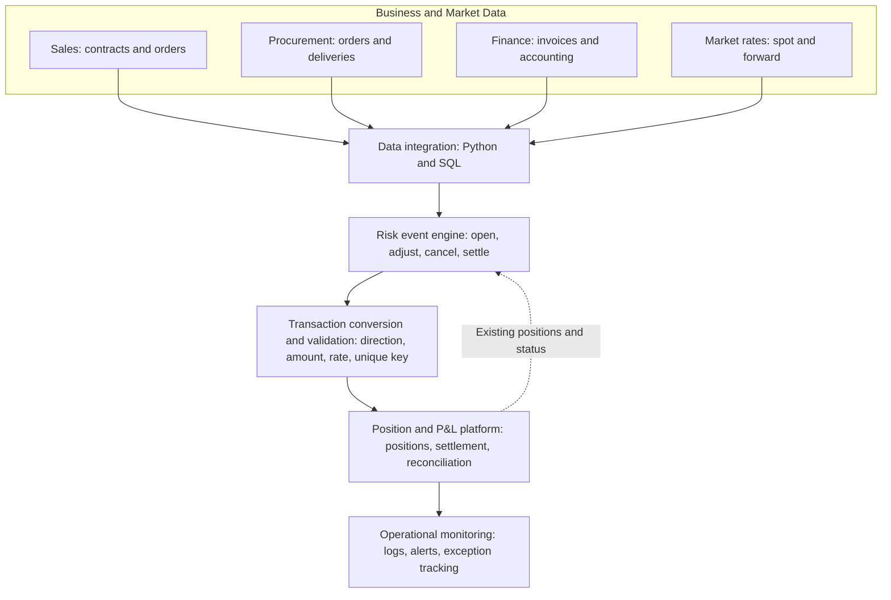
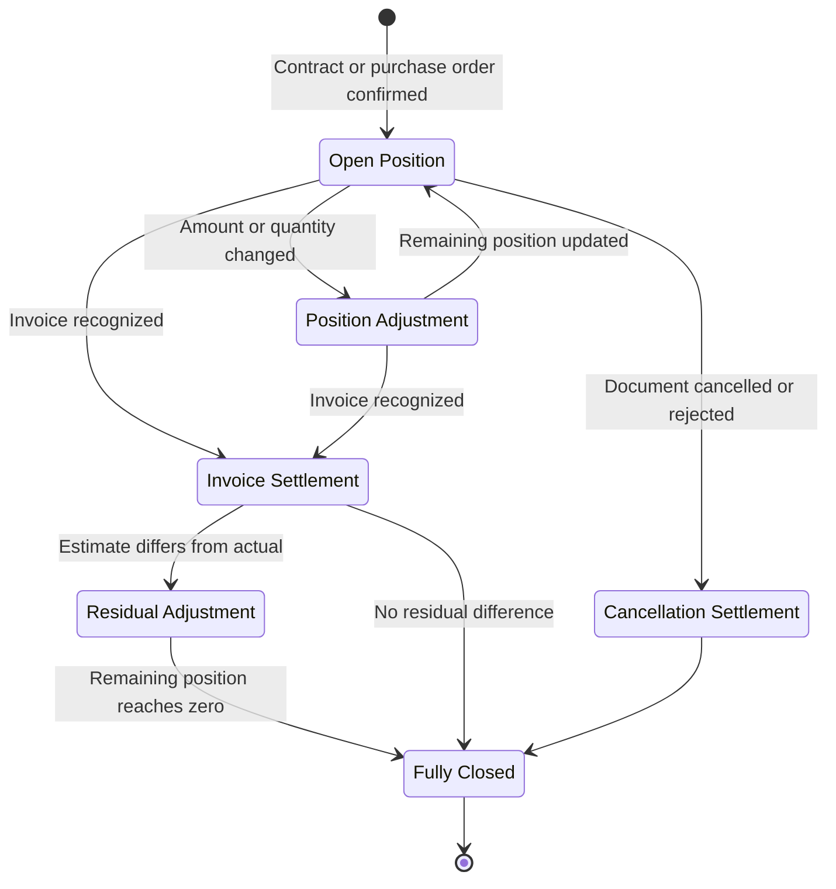

[繁體中文](architecture.md) | **English**

# FX Risk Position Automation | System Architecture

## End-to-End Architecture

## Component Responsibilities

| Component | Responsibility |
|---|---|
| Business and market data | Provides sales, procurement, accounting, and exchange-rate inputs |
| Data integration | Extracts, cleanses, standardizes, and links cross-system data |
| Risk event engine | Compares source transactions with existing positions to identify opening, adjustment, cancellation, and settlement events |
| Transaction conversion and validation | Determines direction, amount, and rate; creates unique keys and validates required fields |
| Position and P&L platform | Stores transactions, calculates open positions and P&L, and supports reconciliation |
| Operational monitoring | Stores run logs and sends summaries, missing-data alerts, and failure notifications |

## Position Lifecycle

## Main Data Flow

1. Retrieve current business transactions and accounting results from source systems.
2. Retrieve existing positions and transaction history from the position-management platform.
3. Standardize document number, line item, date, currency, and amount.
4. Compare source status, existing positions, and amount differences to determine the event.
5. Apply buy/sell direction and exchange-rate rules based on event and currency.
6. Convert the result into the standard transaction format and validate required fields and duplicates.
7. Post to the position-management platform, update settlement status, and store run logs.
8. Send processing summaries or exception alerts to the operations team.

## Diagram Notes

- Solid arrows indicate the primary processing flow.
- The dashed arrow represents feedback from existing positions and transaction status to event detection.
- All system names are de-identified; proprietary architecture details are excluded.
